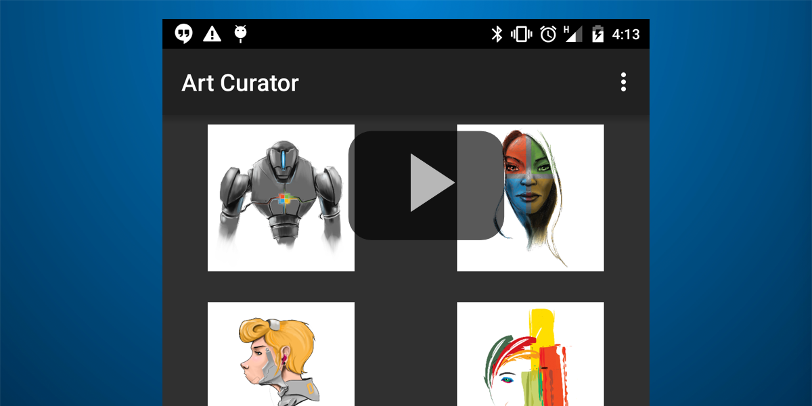

# O365-Android-Art-Curator
[](https://travis-ci.org/OfficeDev/O365-Android-ArtCurator)


In diesem Beispiel wird veranschaulicht, wie Sie die Outlook-E-Mail-API verwenden, um E-Mails und Anhänge aus Office 365 abzurufen. Die API ist für [iOS](https://github.com/OfficeDev/O365-iOS-ArtCurator), Android, [Web (Angular-Web-App)](https://github.com/OfficeDev/O365-Angular-ArtCurator) und [Windows Phone](https://github.com/OfficeDev/O365-WinPhone-ArtCurator) ausgelegt. Informationen hierzu finden Sie auch in unserem [Artikel in Medium](https://medium.com/@iambmelt/14296d0a25be).
<br />
<br />
Das Beispiel zum Art Curator veranschaulicht, wie Sie Ihren Posteingang auf andere Weise anzeigen. Angenommen, Sie besitzen ein Unternehmen, das künstlerisch gestaltete T-Shirts verkauft. Als Inhaber des Unternehmens erhalten Sie eine Vielzahl von E-Mails von Künstlern mit Designs, die Sie von den Künstlern erwerben sollen. Derzeit verwenden Sie Ihren E-Mail-Client, um jede Nachricht und jeden Anhang einzeln zu öffnen. In diesem Beispiel wird gezeigt, wie Sie stattdessen Art Curator verwenden können, um alle Anhänge Ihres Posteingangs (nur JPG- und PNG-Dateien) direkt anzuzeigen und so auf effiziente Weise die gewünschten Designs auszuwählen. 

In diesem Beispiel werden folgende Vorgänge der Outlook Services-E-Mail-API veranschaulicht: 
* [Ordner abrufen](https://msdn.microsoft.com/office/office365/APi/mail-rest-operations#GetFolders)
* [Nachrichten abrufen](https://msdn.microsoft.com/office/office365/APi/mail-rest-operations#Getmessages) (einschließlich Filtern und Verwenden der Auswahl) 
* [Anlagen abrufen](https://msdn.microsoft.com/office/office365/APi/mail-rest-operations#GetAttachments)
* [Nachricht aktualisieren](https://msdn.microsoft.com/office/office365/APi/mail-rest-operations#Updatemessages)
* [Nachrichten erstellen und senden](https://msdn.microsoft.com/office/office365/APi/mail-rest-operations#Sendmessages) (mit und ohne Anlage) 

[](https://youtu.be/4LOvkweDfhY "Klicken Sie, um das Beispiel in Aktion zu sehen")

Voraussetzungen
==
* [Android Studio](https://developer.android.com/sdk/index.html)-Version 1.0 +
* Ein Office 365-Konto. Sie können sich für ein [Office 365-Entwicklerabonnement](https://msdn.microsoft.com/de-de/library/office/fp179924.aspx) registrieren, das die Ressourcen zum Erstellen von Office 365-Apps umfasst.

**Hinweis**<br />
Sie müssen zudem sicherstellen, dass Ihr Azure-Abonnement an Ihren Office 365-Mandanten gebunden ist. Die entsprechenden Anweisungen finden Sie im Blogpost [Creating and Managing Multiple Windows Azure Active Directories](http://blogs.technet.com/b/ad/archive/2013/11/08/creating-and-managing-multiple-windows-azure-active-directories.aspx) (Erstellen und Verwalten mehrerer Windows Azure Active Directories, in englischer Sprache) des Active Directory-Teams. In diesem Beitrag finden Sie unter „Adding a new directory“ (Hinzufügen eines neuen Verzeichnisses, in englischer Sprache) Informationen über die entsprechende Vorgehensweise. Weitere Informationen finden Sie auch unter [Set up Azure Active Directory access for your Developer Site](https://msdn.microsoft.com/office/office365/howto/setup-development-environment#bk_CreateAzureSubscription) (Einrichten des Zugriffs auf Active Directory für Ihre Entwicklerwebsite, in englischer Sprache).

Importieren in Android Studio
==
* Repository klonen
* Android Studio öffnen
  * Projekt importieren (Eclipse ADT, Gradle usw.) &gt; Wählen Sie das Zielprojekt aus ```settings.gradle```

Zum ersten Mal starten
==
Diese App enthält vorregistrierte Anwendungsinformationen in Azure mit den Berechtigungen **E-Mail als Benutzer senden** und **Benutzer-E-Mails lesen und schreiben**.

App-Informationen werden in ```com.microsoft.artcurator.conf.ServiceConstants``` definiert.
    
    public static final String CLIENT_ID = "1feaa784-0130-48d9-adeb-776fc65888c5";
    public static final String REDIRECT_URI = "https://useonlytoruntheartcuratorsample/";
        
Für Ihre eigene App [registrieren Sie Ihre systemeigene Clientanwendung auf Azure](https://msdn.microsoft.com/library/azure/dn132599.aspx#BKMK_Adding). 

Geben Sie den Umleitungs-URI an, wenn Sie die Anwendung registrieren. Rufen Sie als Nächstes die Client-ID von der Seite **CONFIGURE** ab. Die Anwendung *muss* über die Berechtigungen **E-Mails als Benutzer senden** und **Benutzer-E-Mails lesen und schreiben** verfügen.

Weitere Informationen finden Sie unter [O365-Android-Connect-Beispiel](https://github.com/OfficeDev/O365-Android-Connect) Einschränkungen.
==
* Unterstützung anderer Dateien als ```.png``` und ```.jpg```
* Verarbeitung von E-Mails mit mehreren Anhängen
* Paging (Abrufen von mehr als 50 E-Mails)
* Verarbeitung der Eindeutigkeit von Ordnernamen
* Der Ordner zum Senden muss ein Ordner der obersten Ebene sein.

Fragen und Kommentare
==
* Wenn Sie beim Ausführen dieses Beispiels Probleme haben, [melden Sie sie bitte](https://github.com/OfficeDev/O365-Android-ArtCurator/issues).
* Veröffentlichen Sie allgemeine Fragen zu Office 365-APIs im [Stapelüberlauf](http://stackoverflow.com/). Stellen Sie sicher, dass Ihre Fragen oder Kommentare mit [Office365] und [outlook-restapi] markiert sind.

Zusätzliche Ressourcen
==
* [Get started with Office 365 APIs in apps](https://msdn.microsoft.com/en-us/office/office365/howto/getting-started-Office-365-APIs) (Erste Schritte mit Office 365-APIs in Apps, in englischer Sprache)
* [Office Dev Center (Android)](http://dev.office.com/Android)
* [Office 365-APIs – Plattformübersicht](http://stackoverflow.com/)
* [Art Curator für iOS](https://github.com/OfficeDev/O365-iOS-ArtCurator)
* [Art Curator für Windows Phone](https://github.com/OfficeDev/O365-WinPhone-ArtCurator)
* [Art Curator für Web (Angular-Web-App)](https://github.com/OfficeDev/O365-Angular-ArtCurator)

Copyright
==
Copyright (c) 2015 Microsoft. Alle Rechte vorbehalten.

