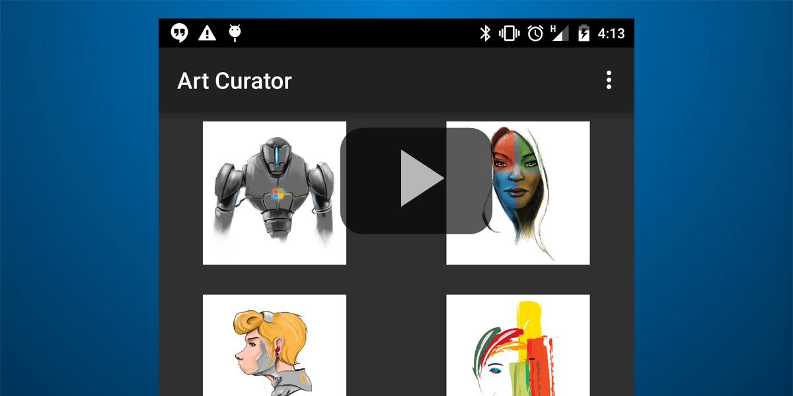

# O365-Android-Art-Curator
[](https://travis-ci.org/OfficeDev/O365-Android-ArtCurator)


此示例演示如何使用 Outlook 邮件 API 从 Office 365 获取电子邮件和附件。它为 [iOS](https://github.com/OfficeDev/O365-iOS-ArtCurator)、 Android、[Web（Angular Web 应用）](https://github.com/OfficeDev/O365-Angular-ArtCurator)和 [Windows Phone](https://github.com/OfficeDev/O365-WinPhone-ArtCurator) 而构建。查看我们的[媒体文章](https://medium.com/@iambmelt/14296d0a25be)。
<br />
<br />
Art Curator 示例提供了一种不同的方式来查看收件箱。想象您拥有一家销售艺术 T 恤的公司。作为公司的所有者，您会收到大量艺术家发送的电子邮件，其中附有他们希望您购买的设计。目前，您可以使用您的电子邮件客户端来打开每封邮件和附件。而使用 Art Curator 示例，您可以先预览收件箱的附件视图，以便选取您喜欢的设计。

此示例从 Outlook Services 邮件 API 演示以下操作：
* [获取文件夹](https://msdn.microsoft.com/office/office365/APi/mail-rest-operations#GetFolders)
* [获取邮件](https://msdn.microsoft.com/office/office365/APi/mail-rest-operations#Getmessages)（包括筛选和使用选择）
* [获取附件](https://msdn.microsoft.com/office/office365/APi/mail-rest-operations#GetAttachments)
* [更新邮件](https://msdn.microsoft.com/office/office365/APi/mail-rest-operations#Updatemessages)
* [创建并发送邮件](https://msdn.microsoft.com/office/office365/APi/mail-rest-operations#Sendmessages)（带有附件和不带有附件）

[](https://youtu.be/4LOvkweDfhY "单击查看活动示例")

先决条件
==
* [Android Studio](https://developer.android.com/sdk/index.html) ver.1.0+
* 一个 Office 365 帐户。您可以注册 [Office 365 开发人员订阅](https://msdn.microsoft.com/en-us/library/office/fp179924.aspx)，其中包含资源以便开始构建 Office 365 应用。

**注意**<br/>
您还需要确保您的 Azure 订阅已绑定到 Office 365 租户。有关说明，请查看 Active Directory 团队的博客文章[创建和管理多个 Microsoft Azure Active Directory](http://blogs.technet.com/b/ad/archive/2013/11/08/creating-and-managing-multiple-windows-azure-active-directories.aspx)。在本文章中，“添加新目录”一节将介绍如何执行此操作。您还可以阅读[设置 Azure Active Directory 对开发人员网站的访问](https://msdn.microsoft.com/office/office365/howto/setup-development-environment#bk_CreateAzureSubscription)，了解详细信息。

导入到 Android Studio
==
*克隆该存储库
*打开 Android Studio
 *导入项目（Eclipse ADT、Gradle 等）> 选择目标项目的 ```settings.gradle```

首次启动
==
此应用程序中包含 Azure 上预注册的应用程序信息，具有“以用户身份发送邮件”****和“读取和写入用户邮件”****权限。

应用信息在 ```com.microsoft.artcurator.conf.ServiceConstants``` 中进行定义。
    
   public static final String CLIENT_ID = "1feaa784-0130-48d9-adeb-776fc65888c5";
   public static final String REDIRECT_URI = "https://useonlytoruntheartcuratorsample/";
       
对于您自己的应用，[在 Azure 上注册本机客户端应用程序](https://msdn.microsoft.com/library/azure/dn132599.aspx#BKMK_Adding)。

在注册应用程序时，请指定重定向 URI。接下来，从“配置”****页面获取客户端 ID。
应用程序*必须*拥有“以用户身份发送邮件”****权限和“读取和写入用户邮件”****权限。

有关详细信息，请参阅 [O365-Android-Connect 示例](https://github.com/OfficeDev/O365-Android-Connect)
限制
==
*文件支持不再局限于 ```.png``` 和 ```.jpg```
*处理带有多个附件的单个电子邮件
*分页（获取超过 50 个电子邮件）
*处理文件夹名称唯一性
*提交文件夹必须是顶级文件夹

问题和意见
==
*如果您在运行此示例时遇到任何问题，请[记录问题](https://github.com/OfficeDev/O365-Android-ArtCurator/issues)。
*对于有关 Office 365 API 的常规问题，请发布到 [Stack Overflow](http://stackoverflow.com/)。请确保您的问题或意见使用 [Office365] 和 [outlook-restapi] 进行标记。

其他资源
==
* [应用中 Office 365 API 入门](https://msdn.microsoft.com/zh-cn/office/office365/howto/getting-started-Office-365-APIs)
* [Office 开发人员中心 (Android)](http://dev.office.com/Android)
* [Office 365 API 平台概述](http://stackoverflow.com/)
* [Art Curator for iOS](https://github.com/OfficeDev/O365-iOS-ArtCurator)
* [Art Curator for Windows Phone](https://github.com/OfficeDev/O365-WinPhone-ArtCurator)
* [Art Curator for Web（Angular Web 应用）](https://github.com/OfficeDev/O365-Angular-ArtCurator)

版权所有
==
版权所有 (c) 2015 Microsoft。保留所有权利。

